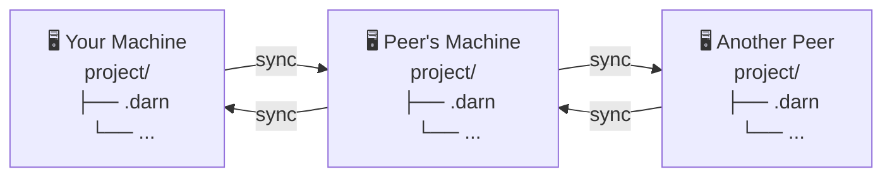

# darn 🪡🧦

<u>D</u>irectory-based <u>A</u>utomerge <u>R</u>eplication <u>N</u>ode

A CLI for managing CRDT-backed files with automatic conflict resolution and peer-to-peer synchronization.

## Overview

`darn` brings collaborative editing to your filesystem. Files are stored as [Automerge] documents and synchronized peer-to-peer using [Subduction]. Think of it as "Dropbox meets git" - but without merge conflicts or the vendor lock-in.



## Features

- **Local-first**: Works offline, syncs when connected
- **Conflict-free**: CRDTs automatically merge concurrent edits
- **P2P sync**: No central server required (though you can run one)
- **Text collaboration**: Character-level merging for text files
- **Dropbox-like**: Everything syncs by default, use ignore patterns to exclude

## Quick Start

```bash
# Initialize a workspace
darn init

# Add a peer
darn peer add --name relay --websocket ws://localhost:9000

# Check status
darn tree

# Sync with peers
darn sync

# Clone from another machine
darn clone <root_id> my-project

# Watch for changes and auto-sync
darn watch
```

See [`darn_cli/README.md`] for full CLI documentation.

## Installation

### Homebrew

```bash
brew tap inkandswitch/darn https://github.com/inkandswitch/darn
brew install darn
```

### Prebuilt Binaries

Download from [GitHub Releases]. Binaries are available for:

| Platform               | Binary                    |
|------------------------|---------------------------|
| macOS (Apple Silicon)  | `darn-macos-aarch64`      |
| macOS (Intel)          | `darn-macos-x86_64`       |
| Linux x86_64           | `darn-linux-x86_64`       |
| Linux x86_64 (static)  | `darn-linux-x86_64-musl`  |
| Linux aarch64          | `darn-linux-aarch64`      |
| Linux aarch64 (static) | `darn-linux-aarch64-musl` |
| Windows x86_64         | `darn-windows-x86_64`     |

### From Source

```bash
cargo install --path darn_cli
```

### Nix

```bash
nix build   # or: nix develop
```

## Crates

| Crate         | Description                                   |
|---------------|-----------------------------------------------|
| [`darn_core`] | Core library - workspace, documents, manifest |
| [`darn_cli`]  | CLI binary - user-facing commands             |

## How It Works

### Sync Model

Unlike git, darn uses a Dropbox-like model: _everything syncs by default_. There's no staging area or explicit tracking step. Use `darn ignore` to exclude files you don't want synced.

### File Storage

Files are converted to Automerge documents following the Patchwork schema:

| File Type | Storage Format | Merge Semantics             |
|-----------|----------------|-----------------------------|
| Text      | `Text` object  | Character-level CRDT        |
| Binary    | `Bytes` scalar | Whole-file last-writer-wins |

### Storage Layout

```
~/.config/darn/                     # Global config
├── signer/signing_key.ed25519      # Ed25519 identity
├── peers/{name}.json               # Peer configurations
├── workspaces.json                 # Registry (id → path)
└── workspaces/<id>/
    ├── manifest.json               # Tracked files
    └── storage/                    # Managed by sedimentree_fs_storage

project/
├── .darn                           # JSON marker file
└── ...                             # Your files
```

### Sync Protocol

darn uses Subduction for peer-to-peer synchronization:

1. **Sedimentree** partitions documents into content-addressed fragments
2. **Strata** (hash-based depth levels) enable efficient set reconciliation
3. **WebSocket** transport with Ed25519 authentication

## Development

```bash
cargo build    # Build
cargo test     # Test
cargo clippy   # Lint
```

See [HACKING.md] for development details.

## License

Apache-2.0 OR MIT

<!-- Links -->

[Automerge]: https://automerge.org/
[GitHub Releases]: https://github.com/inkandswitch/darn/releases
[HACKING.md]: HACKING.md
[Subduction]: https://github.com/inkandswitch/subduction
[`darn_cli`]: darn_cli/
[`darn_core`]: darn_core/
[`darn_cli/README.md`]: darn_cli/README.md
